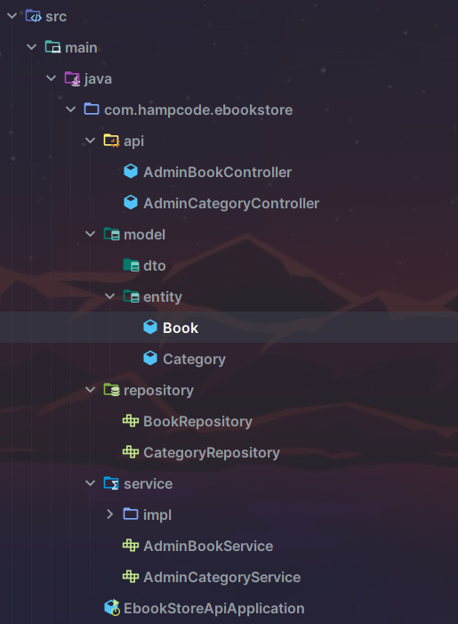

# Ebook Store Book - Guía de Implementación: Sesión 1

## Introducción

En esta primera sesión, aprenderemos a configurar el entorno para la aplicación **Ebook Store Book**. Esta guía cubrirá los siguientes temas:

- Requisitos funcionales & Diseño de la API REST.
- Creación del proyecto para la API REST .
- Preparación de la Base de Datos.
- Implementación de los endpoints para gestionar las categorías y libros, incluyendo:
  - Mapeo de las entidades `Category` y `Book`.
  - Creación del repositorio.
  - Creación del servicio.
  - Creación del controlador.
  

## Requisitos Funcionales & Diseño de la API REST

En esta sección, se definen los requisitos funcionales y el diseño de la API REST para la aplicación **Ebook Store Book**. La API permitirá gestionar libros y categorías, así como integrar pagos a través de PayPal.

Para obtener el documento con el detalle completo, puedes acceder al siguiente enlace: [Documento Detallado - Requisitos Funcionales & Diseño de la API REST](https://bit.ly/4dYq203).


## Creación del Proyecto para la API REST

En esta sección, se inicia la creación del proyecto para la API REST utilizando **Spring Boot** con las siguientes dependencias:

- **Spring Boot**: Herramienta que simplifica la configuración y el desarrollo de aplicaciones Java.
- **Spring Data JPA**: Abstracción de persistencia que facilita el uso de JPA con bases de datos relacionales.
- **PostgreSQL Driver**: Controlador JDBC necesario para conectar y operar con bases de datos PostgreSQL.
- **Lombok**: Biblioteca que reduce el código repetitivo mediante anotaciones, facilitando la generación de getters, setters, y constructores.
- **DevTools**: Herramienta que permite la actualización automática del servidor durante el desarrollo.

Para obtener la configuración completa y utilizarla como plantilla para tu proyecto, puedes acceder al siguiente enlace: [Configuración de Plantilla del Proyecto](https://bit.ly/3T65ESI).



## Preparación de la Base de Datos

En esta sección, configuraremos la base de datos PostgreSQL para almacenar la información de los libros y categorías. Vamos a detallar cómo establecer la conexión de la base de datos y configurar Hibernate para manejar automáticamente las entidades.

### Configuración del Archivo `application.properties`

El archivo `application.properties` es fundamental en una aplicación Spring Boot, ya que define varias configuraciones esenciales para el funcionamiento del sistema, incluyendo la conexión a la base de datos y las propiedades de JPA/Hibernate.

Aquí está el contenido del archivo `application.properties` con comentarios explicativos:

```properties
# Nombre de la aplicación y ruta base de los endpoints REST
spring.application.name=ebook-store-api  
server.servlet.context-path=/api/v1 

# Configuración de la base de datos
spring.datasource.url=jdbc:postgresql://localhost:5433/ebook_store_db
spring.datasource.username=postgres
spring.datasource.password=admin
spring.datasource.driver-class-name=org.postgresql.Driver

# Propiedades de JPA/Hibernate
spring.jpa.properties.hibernate.dialect=org.hibernate.dialect.PostgreSQLDialect
spring.jpa.hibernate.ddl-auto=update
spring.jpa.show-sql=true
spring.jpa.properties.hibernate.format_sql=true
```


### Implementación de los Endpoints para Gestionar las Categorías y Libros

En esta sección, se implementarán los endpoints necesarios para realizar operaciones CRUD (Crear, Leer, Actualizar, Eliminar) sobre las entidades **Category** y **Book**. Estos endpoints permitirán a los administradores gestionar eficientemente el inventario de libros y las categorías en la aplicación.

#### Mapeo de las Entidades: Explicación de Anotaciones

En esta sección, se detallan las anotaciones más importantes utilizadas en las entidades **Category** y **Book** de la aplicación **Ebook Store Book**. Estas anotaciones son de **Jakarta Persistence API (JPA)** y **Lombok**, y se utilizan para definir cómo se deben mapear las clases de Java a las tablas de la base de datos.

| Anotación                                                                 | Descripción                                                                                                            |
|---------------------------------------------------------------------------|------------------------------------------------------------------------------------------------------------------------|
| `@Data` (Lombok)                                                          | Genera automáticamente métodos como getters, setters, `toString`, `equals`, y `hashCode`.                              |
| `@Entity` (JPA)                                                           | Marca la clase como una entidad JPA para mapeo a una tabla de la base de datos.                                        |
| `@Table(name = "table_name")` (JPA)                                       | Define el nombre de la tabla en la base de datos a la que se mapeará la entidad.                                        |
| `@Id` (JPA)                                                               | Indica el campo como clave primaria de la entidad.                                                                     |
| `@GeneratedValue(strategy = GenerationType.IDENTITY)` (JPA)               | Configura la generación automática del valor de la clave primaria por la base de datos.                                |
| `@ManyToOne` (JPA)                                                        | Establece una relación de muchos a uno entre dos entidades.                                                            |
| `@JoinColumn(name = "column_name", referencedColumnName = "column_name")` (JPA) | Especifica la columna utilizada para unir dos tablas en una relación de entidad.                                        |

### Uso de Anotaciones de Jakarta Persistence API (JPA)

Las anotaciones de **Jakarta Persistence API (JPA)**, como `@Entity`, `@Table`, `@Id`, `@GeneratedValue`, `@ManyToOne`, y `@JoinColumn`, son fundamentales para el mapeo objeto-relacional en Java. Estas anotaciones permiten definir cómo se deben persistir los objetos Java en una base de datos relacional, especificando detalles como el nombre de la tabla, la clave primaria, la generación de identificadores, y las relaciones entre tablas.

Estas anotaciones facilitan el desarrollo al permitir que el desarrollador se enfoque en la lógica de negocio en lugar de la infraestructura de persistencia, asegurando que los datos se gestionen de manera consistente y eficiente en la base de datos.

##### Código de Entidades

```java

import jakarta.persistence.*;
import lombok.Data;

import java.time.LocalDateTime;

@Data
@Entity
@Table(name = "categories")
public class Category {
    @Id
    @GeneratedValue(strategy = GenerationType.IDENTITY)
    private Integer id;
    private String name;
    private String description;
    private LocalDateTime createdAt;
    private LocalDateTime updatedAt;
}
```
```java

import jakarta.persistence.*;
import lombok.Data;

import java.time.LocalDateTime;

@Data
@Entity
@Table(name = "books")
public class Book {
    @Id
    @GeneratedValue(strategy = GenerationType.IDENTITY)
    private Integer id;

    private String title;
    private String slug;
    private String description;
    private Float price;
    private String coverPath;
    private String filePath;
    private LocalDateTime createdAt;
    private LocalDateTime updatedAt;

    @ManyToOne
    @JoinColumn(name = "category_id", referencedColumnName = "id", foreignKey = @ForeignKey(name = "fk_book_category"))
    private Category category;
}
```

### Creación del Repositorio

En esta sección, se crean los repositorios para las entidades **Category** y **Book** utilizando **Spring Data JPA**. **Spring Data JPA** simplifica el acceso a los datos y permite realizar operaciones CRUD (Crear, Leer, Actualizar, Eliminar) de manera sencilla y eficiente sobre las entidades mapeadas a la base de datos, sin necesidad de escribir código SQL manualmente. Además, proporciona funcionalidad adicional como paginación, ordenación, y manejo de relaciones.

#### Repositorio para la Entidad `Category`

| **Interfaz**             | **Descripción**                                                                                  |
|--------------------------|--------------------------------------------------------------------------------------------------|
| `JpaRepository`          | Proporciona métodos CRUD y funcionalidad adicional como paginación y ordenación para las entidades. |

El repositorio `CategoryRepository` extiende la interfaz `JpaRepository`, proporcionando métodos CRUD listos para usar, como `findAll()`, `save()`, `deleteById()`, y muchos otros sin la necesidad de implementarlos explícitamente.


##### Repositorio para la Entidad `Category`

El repositorio `CategoryRepository` extiende la interfaz `JpaRepository`, proporcionando métodos CRUD listos para usar.

```java
import com.hampcode.ebookstore.model.entity.Category;
import org.springframework.data.jpa.repository.JpaRepository;

public interface CategoryRepository extends JpaRepository<Category, Integer> {
}

```

##### Repositorio para la Entidad `Book`

El repositorio `BookRepository` extiende la interfaz `JpaRepository`, proporcionando métodos CRUD listos para usar.

```java
import com.hampcode.ebookstore.model.entity.Book;
import org.springframework.data.jpa.repository.JpaRepository;

public interface BookRepository extends JpaRepository<Book, Integer> {
}

```

### Creación del Servicio

En esta sección, se desarrollan los servicios para gestionar la lógica de negocio de las entidades **Category** y **Book**. Los servicios encapsulan las reglas de negocio, como las validaciones de datos y operaciones complejas, que no deberían estar en los controladores o repositorios.

#### Lógica de Negocio

La lógica de negocio se refiere a las reglas y procedimientos que determinan cómo se deben gestionar los datos en la aplicación. Por ejemplo, antes de guardar un libro, el servicio podría validar que la categoría asignada al libro existe en la base de datos y que el título del libro no esté duplicado para evitar conflictos en el inventario.

#### Importancia de Utilizar Interfaces en el Patrón de Inyección de Dependencias

#### Importancia de Utilizar Interfaces en el Patrón de Inyección de Dependencias

El uso de interfaces como `AdminCategoryService` y `AdminBookService` permite definir contratos que las clases de implementación (`AdminCategoryServiceImpl` y `AdminBookServiceImpl`) deben cumplir. Esto facilita la inyección de dependencias, ya que permite cambiar la implementación concreta sin afectar a las partes del código que dependen de la interfaz. También mejora la testabilidad, ya que se pueden utilizar mocks o stubs de las interfaces en las pruebas unitarias.

| **Anotación**                   | **Descripción**                                                                                                     |
|---------------------------------|----------------------------------------------------------------------------------------------------------------------|
| `@Service`                      | Marca una clase como un servicio de negocio en la capa de servicio, gestionando la lógica de negocio.                 |
| `@RequiredArgsConstructor`      | Genera un constructor con todos los argumentos necesarios para los campos finales, facilitando la inyección de dependencias. |
| `@Transactional`                | Gestiona automáticamente las transacciones de la base de datos, asegurando la coherencia y el manejo adecuado de errores. |

##### Interface `AdminCategoryService`
La interfaz `AdminCategoryService` define un contrato para el servicio que maneja la lógica de negocio relacionada con las categorías en la aplicación **Ebook Store**. Al usar una interfaz, se facilita la inyección de dependencias y se permite cambiar la implementación concreta sin afectar a las capas superiores.


```java
import com.hampcode.ebookstore.model.entity.Category;
import org.springframework.data.domain.Page;
import org.springframework.data.domain.Pageable;
import java.util.List;

public interface AdminCategoryService {
    List<Category> findAll();
    Page<Category> paginate(Pageable pageable);
    Category create(Category category);
    Category findById(Integer id);
    Category update(Integer id, Category updatedCategory);
    void delete(Integer id);
}
```

##### Interface `AdminCategoryServiceImpl`
La clase `AdminCategoryServiceImpl` es la implementación concreta de la interfaz `AdminCategoryService`. Esta clase gestiona la lógica de negocio para las operaciones relacionadas con las categorías, como creación, actualización, eliminación, y paginación. Utiliza el repositorio `CategoryRepository` para interactuar con la base de datos.


```java
import com.hampcode.ebookstore.model.entity.Category;
import com.hampcode.ebookstore.repository.CategoryRepository;
import com.hampcode.ebookstore.service.AdminCategoryService;
import lombok.AllArgsConstructor;
import lombok.RequiredArgsConstructor;
import org.springframework.data.domain.Page;
import org.springframework.data.domain.Pageable;
import org.springframework.stereotype.Service;
import org.springframework.transaction.annotation.Transactional;

import java.time.LocalDateTime;
import java.util.List;


@RequiredArgsConstructor
@Service
public class AdminCategoryServiceImpl implements AdminCategoryService {

    private final CategoryRepository categoryRepository;

    @Transactional(readOnly = true)
    @Override
    public List<Category> findAll() {
        return categoryRepository.findAll();
    }

    @Transactional(readOnly = true)
    @Override
    public Page<Category> paginate(Pageable pageable) {
        return categoryRepository.findAll(pageable);
    }

    @Transactional
    @Override
    public Category create(Category category) {
        category.setCreatedAt(LocalDateTime.now());
        return categoryRepository.save(category);
    }

    @Transactional(readOnly = true)
    @Override
    public Category findById(Integer id) {
        return categoryRepository.findById(id).orElseThrow(() -> new RuntimeException("Category not found with id: " + id));
    }

    @Transactional
    @Override
    public Category update(Integer id, Category updatedCategory) {
        Category categoryFromDb = findById(id);
        categoryFromDb.setName(updatedCategory.getName());
        categoryFromDb.setDescription(updatedCategory.getDescription());
        return categoryRepository.save(categoryFromDb);
    }

    @Transactional
    @Override
    public void delete(Integer id) {
        Category category = findById(id);
        categoryRepository.delete(category);
    }
}
```

##### Interface `AdminBookService`
La interfaz `AdminBookService` define un contrato para el servicio que maneja la lógica de negocio relacionada con los libros en la aplicación **Ebook Store**. Al usar una interfaz, se facilita la inyección de dependencias y se permite cambiar la implementación concreta sin afectar a las capas superiores.


```java
import com.hampcode.ebookstore.model.entity.Book;
import org.springframework.data.domain.Page;
import org.springframework.data.domain.Pageable;

import java.util.List;

public interface AdminBookService {
    List<Book> findAll();
    Page<Book> paginate(Pageable pageable);
    Book create(Book book);
    Book findById(Integer id);
    Book update(Integer id, Book updatedBook);
    void delete(Integer id);
}
```

##### Interface `AdminBookServiceImpl`
La clase `AdminBookServiceImpl` es la implementación concreta de la interfaz `AdminBookService`. Esta clase gestiona la lógica de negocio para las operaciones relacionadas con las categorías, como creación, actualización, eliminación, y paginación. Utiliza el repositorio `BookRepository` para interactuar con la base de datos.


```java
import com.hampcode.ebookstore.model.entity.Book;
import com.hampcode.ebookstore.repository.BookRepository;
import com.hampcode.ebookstore.service.AdminBookService;
import lombok.RequiredArgsConstructor;
import org.springframework.data.domain.Page;
import org.springframework.data.domain.Pageable;
import org.springframework.stereotype.Service;
import org.springframework.transaction.annotation.Transactional;

import java.time.LocalDateTime;
import java.util.List;

@RequiredArgsConstructor
@Service
public class AdminBookServiceImpl implements AdminBookService {
    private final BookRepository bookRepository;

    @Transactional(readOnly = true)
    @Override
    public List<Book> findAll() {
        return bookRepository.findAll();
    }

    @Transactional(readOnly = true)
    @Override
    public Page<Book> paginate(Pageable pageable) {
        return bookRepository.findAll(pageable);
    }

    @Transactional
    @Override
    public Book create(Book book) {
        book.setCreatedAt(LocalDateTime.now());
        return bookRepository.save(book);
    }

    @Transactional(readOnly = true)
    @Override
    public Book findById(Integer id) {
        return bookRepository.findById(id).orElseThrow(() -> new RuntimeException("Book not found with id: " + id));
    }

    @Transactional
    @Override
    public Book update(Integer id, Book updatedBook) {
        Book bookFromDb = findById(id);  // Utiliza orElseThrow dentro de findById

        // Actualización de los campos del libro
        bookFromDb.setTitle(updatedBook.getTitle());
        bookFromDb.setDescription(updatedBook.getDescription());
        bookFromDb.setPrice(updatedBook.getPrice());
        bookFromDb.setSlug(updatedBook.getSlug());
        bookFromDb.setCoverPath(updatedBook.getCoverPath());
        bookFromDb.setFilePath(updatedBook.getFilePath());
        bookFromDb.setUpdatedAt(LocalDateTime.now());

        return bookRepository.save(bookFromDb);
    }

    @Transactional
    public void delete(Integer id) {
        Book book = bookRepository.findById(id)
                .orElseThrow(() -> new RuntimeException("Book not found with id: " + id));
        bookRepository.delete(book);
    }
}
```

###  Creación del controlador.

En esta sección, se crea el controlador para gestionar las solicitudes HTTP relacionadas con las categorías y libros en la aplicación **Ebook Store Book**. El controlador actúa como intermediario entre el cliente (por ejemplo, frontend o aplicaciones de terceros) y los servicios de backend, gestionando las entradas del usuario, llamando a los métodos del servicio correspondiente, y devolviendo las respuestas apropiadas.

El controlador para las categorías podría incluir endpoints para realizar operaciones CRUD (Crear, Leer, Actualizar, Eliminar) sobre las categorías. Por ejemplo, endpoints como `GET /categories` para obtener todas las categorías, `POST /categories` para crear una nueva categoría, `PUT /categories/{id}` para actualizar una categoría existente, y `DELETE /categories/{id}` para eliminar una categoría.

| **Anotación**          | **Descripción**                                                                                     |
|------------------------|-----------------------------------------------------------------------------------------------------|
| `@RestController`      | Marca la clase como un controlador de Spring que gestiona solicitudes REST y devuelve respuestas JSON o XML. |
| `@RequestMapping`      | Define la ruta base para todas las solicitudes manejadas por el controlador.                         |
| `@GetMapping`          | Maneja las solicitudes HTTP GET para recuperar recursos.                                             |
| `@PostMapping`         | Maneja las solicitudes HTTP POST para crear nuevos recursos.                                         |
| `@PutMapping`          | Maneja las solicitudes HTTP PUT para actualizar recursos existentes.                                 |
| `@DeleteMapping`       | Maneja las solicitudes HTTP DELETE para eliminar recursos existentes.                                |
| `@PathVariable`        | Extrae valores de las variables de ruta en las solicitudes HTTP. *Ejemplo:* `GET /categories/1` obtiene la categoría con `id = 1`. |
| `@RequestParam`        | Extrae parámetros de consulta de la URL de la solicitud HTTP. *Ejemplo:* `GET /categories/search?name=Fiction` busca categorías con `name = Fiction`. |


##### Controlador `AdminCategoryController`

El controlador `AdminCategoryController` gestiona las solicitudes HTTP para realizar operaciones CRUD (Crear, Leer, Actualizar, Eliminar) sobre las categorías en el contexto de administración de la aplicación **Ebook Store**. Este controlador permite a los administradores listar todas las categorías, paginar resultados, crear nuevas categorías, obtener detalles de una categoría específica, actualizar categorías existentes, y eliminar categorías.


```java
import com.hampcode.ebookstore.model.entity.Category;
import com.hampcode.ebookstore.service.AdminCategoryService;
import lombok.RequiredArgsConstructor;
import org.springframework.data.domain.Page;
import org.springframework.data.domain.Pageable;
import org.springframework.data.web.PageableDefault;
import org.springframework.http.HttpStatus;
import org.springframework.web.bind.annotation.*;

import java.util.List;

@RequiredArgsConstructor
@RestController
@RequestMapping("/admin/categories")
public class AdminCategoryController {
    private final AdminCategoryService adminCategoryService;

    @GetMapping
    public List<Category> list() {
        return adminCategoryService.findAll();
    }

    @GetMapping("/page")
    public Page<Category> paginate(@PageableDefault(size = 5, sort = "name") Pageable pageable) {
        return adminCategoryService.paginate(pageable);
    }

    @ResponseStatus(HttpStatus.CREATED)
    @PostMapping
    public Category create(@RequestBody Category category) {
        return adminCategoryService.create(category);
    }

    @GetMapping("/{id}")
    public Category get(@PathVariable Integer id) {
        return adminCategoryService.findById(id);
    }

    @PutMapping("/{id}")
    public Category update(@PathVariable Integer id, @RequestBody Category category) {
        return adminCategoryService.update(id, category);
    }

    @ResponseStatus(HttpStatus.NO_CONTENT)
    @DeleteMapping("/{id}")
    public void delete(@PathVariable Integer id) {
        adminCategoryService.delete(id);
    }
}

```

##### Controlador `AdminBookController`

El controlador `AdminBookController` gestiona las solicitudes HTTP para realizar operaciones CRUD (Crear, Leer, Actualizar, Eliminar) sobre los libros  en el contexto de administración de la aplicación **Ebook Store**. Este controlador permite a los administradores listar todas los libros, paginar resultados, crear nuevos libros, obtener detalles de un libro específico, actualizar categorías existentes, y eliminar categorías.


```java

import com.hampcode.ebookstore.model.entity.Book;
import com.hampcode.ebookstore.service.AdminBookService;
import lombok.RequiredArgsConstructor;
import org.springframework.data.domain.Page;
import org.springframework.data.domain.Pageable;
import org.springframework.data.web.PageableDefault;
import org.springframework.http.HttpStatus;
import org.springframework.web.bind.annotation.*;

import java.util.List;

@RequiredArgsConstructor
@RestController
@RequestMapping("/admin/books")
public class AdminBookController {
    private final AdminBookService adminBookService;

    @GetMapping()
    public List<Book> list() {
        return adminBookService.findAll();
    }

    @GetMapping("/page")
    public Page<Book> paginate(@PageableDefault(size = 5, sort = "title") Pageable pageable) {
        return adminBookService.paginate(pageable);
    }

    @ResponseStatus(HttpStatus.CREATED)
    @PostMapping
    public Book create(@RequestBody Book bookFormDTO) {
        return adminBookService.create(bookFormDTO);
    }

    @GetMapping("/{id}")
    public Book get(@PathVariable Integer id) {
        return adminBookService.findById(id);
    }

    @PutMapping("/{id}")
    public Book update(@PathVariable Integer id, @RequestBody Book bookFormDTO) {
        return adminBookService.update(id, bookFormDTO);
    }

    @ResponseStatus(HttpStatus.NO_CONTENT)
    @DeleteMapping("/{id}")
    public void delete(@PathVariable Integer id) {
        adminBookService.delete(id);
    }

}
```

### Postman Requests: Endpoints para las Entidades `Category` y `Book`

A continuación, se presentan los endpoints de **Category** y **Book** para realizar solicitudes HTTP utilizando **Postman** en la aplicación **Ebook Store**. La base de la URL para todas las solicitudes es `http://localhost:8080/api/v1`.

Puedes usar la variable `{{base_url}}` en **Postman** para representar la base de la URL, de esta manera si necesitas cambiar el host o el puerto, solo necesitas actualizar la variable.

#### Request para `Category`

| Método HTTP | Request                          | Descripción                                            |
|-------------|-----------------------------------|--------------------------------------------------------|
| `GET`       | `{{base_url}}/categories`          | Obtiene una lista de todas las categorías.              |
| `GET`       | `{{base_url}}/categories/page`     | Pagina las categorías según los parámetros proporcionados. |
| `GET`       | `{{base_url}}/categories/{id}`     | Obtiene los detalles de una categoría específica por su ID. |
| `POST`      | `{{base_url}}/categories`          | Crea una nueva categoría.                               |
| `PUT`       | `{{base_url}}/categories/{id}`     | Actualiza una categoría existente por su ID.            |
| `DELETE`    | `{{base_url}}/categories/{id}`     | Elimina una categoría existente por su ID.              |


#### Request para `Book`


| Método HTTP | Request                          | Descripción                                            |
|-------------|-----------------------------------|--------------------------------------------------------|
| `GET`       | `{{base_url}}/books`               | Obtiene una lista de todos los libros.                  |
| `GET`       | `{{base_url}}/books/page`          | Pagina los libros según los parámetros proporcionados.  |
| `GET`       | `{{base_url}}/books/{id}`          | Obtiene los detalles de un libro específico por su ID.  |
| `POST`      | `{{base_url}}/books`               | Crea un nuevo libro.                                    |
| `PUT`       | `{{base_url}}/books/{id}`          | Actualiza un libro existente por su ID.                 |
| `DELETE`    | `{{base_url}}/books/{id}`          | Elimina un libro existente por su ID.                   |

### Descarga del Archivo de Colección de Postman

Para facilitar las pruebas y validaciones de la API de **Ebook Store Book**, se proporciona un archivo de colección de Postman llamado `ebook-store-api.postman_collection`. Este archivo contiene todos los endpoints necesarios para gestionar las entidades **Category** y **Book**, incluyendo las operaciones CRUD y de paginación.

Puedes descargar el archivo de colección de Postman desde la carpeta `json-postman`:

- [Descargar `ebook-store-api.postman_collection`](json-postman/ebook-store-api.postman_collection.json)

### Instrucciones para Importar la Colección en Postman

1. Abre **Postman** en tu computadora.
2. Haz clic en el botón **Importar** en la esquina superior izquierda.
3. Selecciona la opción **Upload Files**.
4. Navega hasta la carpeta donde guardaste el archivo `ebook-store-api.postman_collection.json` y selecciónalo.
5. Haz clic en **Open** para importar la colección a Postman.
6. Una vez importada, verás la colección **Ebook Store API** en la barra lateral de Postman, con todos los endpoints listos para ser utilizados.

Esta colección te permitirá probar y validar fácilmente las funcionalidades de la API 